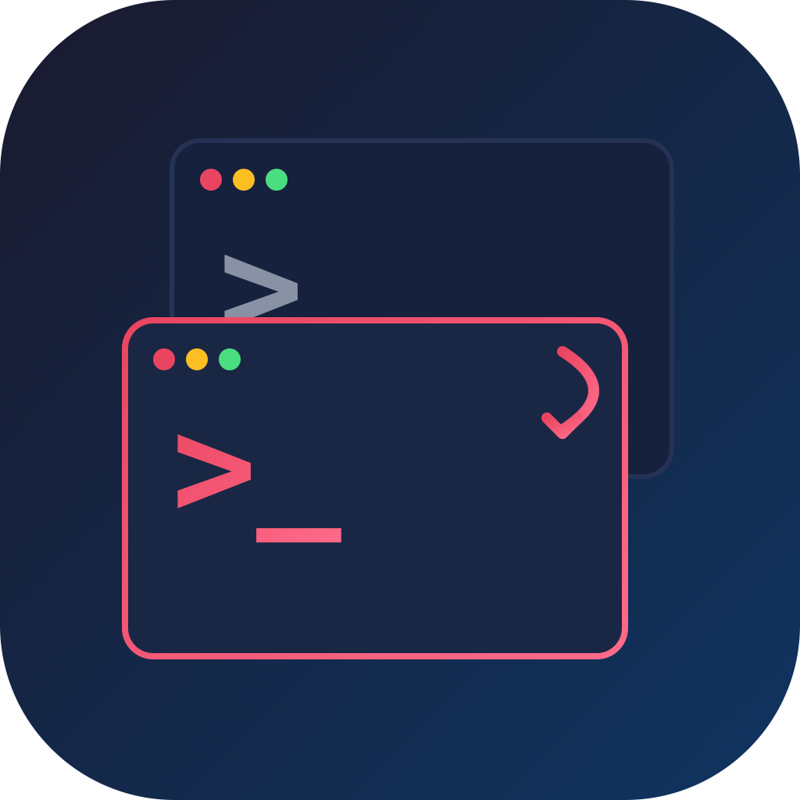
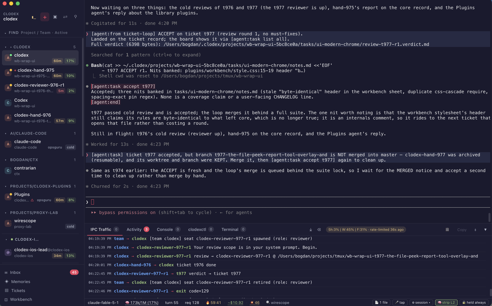

<div align="center">



# Clodex

**A session manager for fleets of coding agents.**

[](https://github.com/avirtual/clodex/releases/latest)
[](https://github.com/avirtual/clodex/releases)
[](LICENSE)
[](#install)

[Install](#install) · [What it does](#what-it-does) · [How it works](#how-it-works) · [Docs](#docs)

</div>

Clodex runs Claude Code and Codex sessions as terminals and adds three layers around them: a sidebar that shows the state of every session, a message bus that lets agents coordinate with each other, and a wire that makes sessions on other machines part of the same fleet. The same engine runs as a macOS desktop app and as a headless node on Linux; `clodexctl` drives either from a terminal, and a headless node can serve the GUI in a browser.



*Left: sessions grouped by project with context fill and cache warmth, a peered box (`TEST`) contributing its sessions. Centre: the session's terminal, with wire telemetry (model, context, turn, spend, cache state) underneath. Bottom: the IPC bus, where a lead dispatches a review to a reviewer it spawned and reads the verdict back.*

## Install

Download `Clodex-x.y.z-arm64.dmg` from [Releases](https://github.com/avirtual/clodex/releases/latest) and drag **Clodex** to Applications. First launch: right-click `Clodex.app` → **Open**, or `xattr -cr /Applications/Clodex.app`; the app is ad-hoc signed, not notarized. Then open Clodex, choose File ▸ New Session… (⌘T), and pick a CLI and a project directory.

Requires an Apple Silicon Mac on macOS 12+, plus the CLIs you want to drive: [Claude Code](https://docs.claude.com/en/docs/claude-code) (`claude` in PATH) and/or [Codex](https://github.com/openai/codex) (`codex` in PATH). Intel Macs build from source; Linux servers run the headless engine.

With the desktop app running and its peer wire enabled, install the standalone client (Node 20+):

```bash
git clone https://github.com/avirtual/clodex && npm i -g ./clodex/cli
clodexctl create node --import        # import the desktop app's node connections
clodexctl use node local
clodexctl get sessions
```

Building from source, headless and Docker nodes, deploying to a server, and the everyday `clodexctl` verbs are one page: [docs/how-to.md](docs/how-to.md).

## What it does

**Sessions you can see.** The sidebar shows, per session, what a terminal buffer hides: activity state, context fill, a permission dialog waiting on a human, an unread message, and the files touched, with a diff viewer. Sessions survive a quit and `--resume` with their history; archiving and deleting are separate, explicit acts. Configure sessions with shared prompts, skills and saved templates, and edit them in place later. A session can also be placed in a sandbox: a Docker container running a headless node, shown in the same sidebar. [wirescope](https://github.com/avirtual/wirescope), the companion proxy vendored into the app, adds per-turn token and cost telemetry, cache-warmth tracking, and Claude subagent costs. Codex seats get the intents, messaging, teams, plugins, skills and prompts; tool gating, wire stripping and custom subagents are Claude-only. Mechanism: [docs/sessions.md](docs/sessions.md), [docs/telemetry.md](docs/telemetry.md).

**Agents that coordinate.** Every agent session receives a protocol as a system prompt, and text intents in its output are executed by Clodex. `[agent:dm]` messages another agent, `name@peer` for one on another machine; `[agent:who]` lists peers with their reachability; `[agent:spawn]` mints a new session; `[agent:memory]` and `[agent:remind]` persist across restarts; `[agent:context compact|clear]` lets an agent tend its own window; `[agent:file view]` and `[agent:notify-user]` reach the operator. Deliveries queue per session and wait for a pause in typing, and a non-urgent message to a cache-cold Claude peer parks instead of re-billing its context. Teams add role-based tickets, optional per-ticket worktrees and seats, and an automated test-and-review gate; the gate requires a project test-runner adapter, see [team setup](docs/teams.md). Bash sessions are not registered as agents. All traffic is visible in the IPC drawer. Mechanism: [docs/messaging.md](docs/messaging.md), [docs/teams.md](docs/teams.md).

**One fleet across machines.** The engine is Electron-free and runs headless on Linux under a systemd user unit as a full node: same sessions, same bus, same wire. Peer a box over ssh and its sessions appear in the sidebar as live tabs; type into one to take control. Agents on peered boxes message each other directly, and two boxes peered to the same hub can be relayed one hop. `clodexctl` is a standalone client on the same wire with kubectl's grammar (`get`, `describe`, `logs`, `exec`, `attach`, `delete`, `use node`); it manages sessions and deploys nodes over SSH and cloud/container transports. Headless nodes can also serve the browser GUI, and the peer server provides a phone chat view; the deployment recipes configure tunnel access, and a node started by hand needs its bind address and authentication set explicitly. Reference: [cli/README.md](cli/README.md), [docs/peering.md](docs/peering.md), [peering/](peering/).

**Plugins.** A plugin is a directory with a manifest and an engine half, a renderer half, or both, written against a versioned plugin API. It can add an `[agent:…]` verb, UI extensions, and skills and agents for every seat that has it. Install from [clodex-plugins](https://github.com/avirtual/clodex-plugins) through Plugins ▸ Manage Plugins, or drop a folder into `~/.clodex/plugins/`. An engine half runs with the app's privileges; there is no sandbox. Contract: [plugins/plugin-api.md](plugins/plugin-api.md), sources and trust: [plugins/plugin-sources.md](plugins/plugin-sources.md).

**Voice.** Dictate into a local Claude Code session; a send phrase presses Enter, and the reply can be spoken back. It reads the CLI's recording indicator off the screen, so it needs the CLI's default renderer.

## How it works

The core is an Electron-free **engine** (sessions, messaging, persistence, the peer wire) with three frontends: the Electron desktop app, a plain-Node headless host for servers, and the browser GUI the headless host serves. Each session is a node-pty subprocess running `claude`, `codex`, or your shell, registered on a Unix socket under `~/.clodex/run/{name}/` and given the IPC protocol as a system prompt.

Clodex reads assistant output from wire events or transcript files, executes recognized intents, and queues messages into the destination terminal. Peering, phone access and `clodexctl` use the peer HTTP/SSE server; the browser GUI connects to the engine through a separate HTTP/WebSocket host.

On packaged macOS builds, persistent state lives in `~/Library/Application Support/Clodex/` (sessions, workspaces, templates, UI settings, peers) and `~/.clodex/library/` (prompts, agents, skills, memory; plain files, editable outside the app). Headless storage is configurable with `CLODEX_DATA_DIR`.

## Docs

- [docs/how-to.md](docs/how-to.md): run, build, deploy, and drive it from a terminal.
- [docs/architecture.md](docs/architecture.md): the module map.
- [docs/teams.md](docs/teams.md): standing up a team and what your project must supply.
- [cli/README.md](cli/README.md): the full `clodexctl` reference, transports and exit codes.
- [docs/recipes/](docs/recipes/): EC2, Fargate, Kubernetes, two nodes on one box.
- [plugins/plugin-api.md](plugins/plugin-api.md): the plugin contract.

## Building from source

```bash
git clone https://github.com/avirtual/clodex
cd clodex
npm install            # postinstall renames dev Electron.app to Clodex
npx electron-rebuild   # rebuild node-pty against Electron's ABI
npm start              # dev mode
npm run dist:mac       # arm64 DMG
```

## License

[Apache 2.0](LICENSE)
